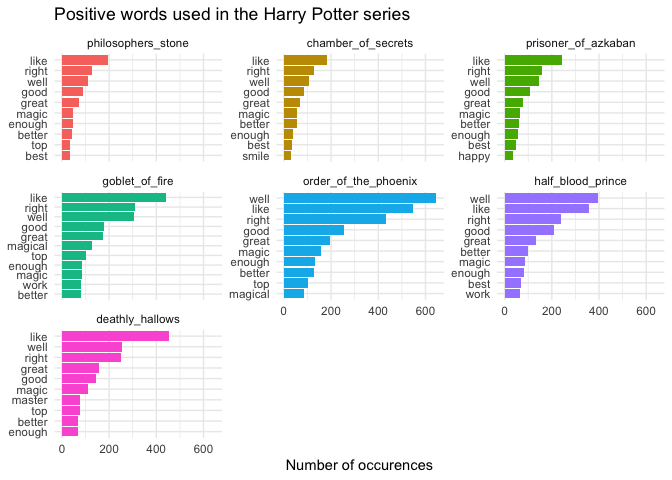
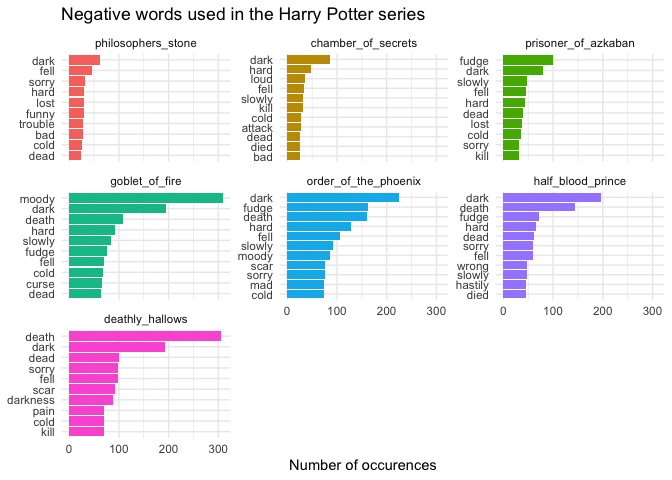
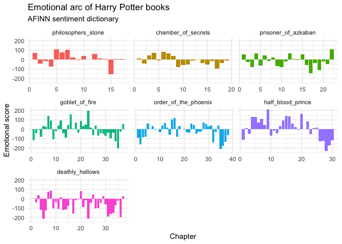

Harry Potter Sentiment Analysis
================
Georgianna James
2022-03-09

# Set Up

## Required Packages

``` r
library(harrypotter)
library(tidyverse)
library(tidytext)
library(textdata)

theme_set(theme_minimal())
```

## Creating Data Frame

Bradley Boehmke’s `harrypotter` package contains the text of the entire
seven book Harry Potter series. The package consists of seven data sets,
one for each novel, with the text stored as one character vector with
each element representing a single chapter.

For my sentiment analysis, I combine all seven novels and store each
word as a single token associated with the chapter and title of the book
it is from. In order to do this, first, I created a character vector for
the title of each book. Then I combined all of the individual novel data
sets into a list and named them using my title character vector. Next, I
make each book its own tibble and and merged them into `book` using the
`map_df()` function. Then I converted `book` to a factor with a level
for each Harry Potter novel. Because the original data contained a row
for each chapter, I created a chapter column by grouping by book and
setting `chapter` equal to `row_number(book)`. Finally, I unnested the
dataframe, making each word its own token.

``` r
# character vector of titles of all books

hp_books <- c("philosophers_stone", "chamber_of_secrets",
              "prisoner_of_azkaban", "goblet_of_fire",
              "order_of_the_phoenix", "half_blood_prince",
              "deathly_hallows")
```

``` r
# combine book data sets into a list
hp_words <- list(
  philosophers_stone,
  chamber_of_secrets,
  prisoner_of_azkaban,
  goblet_of_fire,
  order_of_the_phoenix,
  half_blood_prince,
  deathly_hallows
) %>%
  # name each list element
  set_names(hp_books) %>%
  # convert each book to a data frame and merge into a single data frame
  map_df(as_tibble, .id = "book") %>%
  # convert book to a factor
  mutate(book = factor(book, levels = hp_books)) %>%
  # remove empty chapters
  drop_na(value) %>%
  # create a chapter id column
  group_by(book) %>%
  mutate(chapter = row_number(book)) %>%
  ungroup() %>%
  # tokenize the data frame
  unnest_tokens(word, value)

head(hp_words)
```

    ## # A tibble: 6 × 3
    ##   book               chapter word 
    ##   <fct>                <int> <chr>
    ## 1 philosophers_stone       1 the  
    ## 2 philosophers_stone       1 boy  
    ## 3 philosophers_stone       1 who  
    ## 4 philosophers_stone       1 lived
    ## 5 philosophers_stone       1 mr   
    ## 6 philosophers_stone       1 and

## Visualization of Most Frequent Words, by book

<!-- -->

# Sentiment Analysis Using Bing Dictionary

### Generate data frame with sentiment derived from the Bing dictionary

``` r
# creating df from bBng dictionary
hp_sentiment_analysis <- get_sentiments("bing")

# joining by words from hp books that are also in the Bing dictionairy

harry_potter_sentiment_analysis <- left_join(hp_words, hp_sentiment_analysis, by = "word") %>% 
  drop_na(sentiment)
```

## Most frequently used sentimental words, both positive and negative, in the whole series

<!-- -->

### Generate a data frame that counts the frequency of each word by book and sentiment.

``` r
hp_pos_neg_book <- harry_potter_sentiment_analysis %>%
  # count freq for each book, word, and sentiment
  group_by(book, sentiment) %>%
  count(word) %>%
  # extract 10 most frequent pos/neg words per book
  group_by(book, sentiment) %>%
  slice_max(order_by = n, n = 10)
```

## Most Frequently Used Positive Words, by book

<!-- -->

## Most Frequently Used Negative Words, by book

<!-- -->

# Sentiment Analysis Using AFINN Dictionary

### Generate data frame with sentiment derived from the AFINN dictionary

``` r
# creating df from AFINN dictionary
hp_afinn_sentiment_analysis <- get_sentiments("afinn") 
  

# joining by words from hp books that are also in the AFINN dictionairy

hp_afinn_sentiment_analysis <- inner_join(hp_words, hp_afinn_sentiment_analysis, by = "word") %>% 
  group_by(book, chapter) %>% 
  summarize(value = sum(value))
```

## Emotional arc of Harry Potter books

<!-- -->

### Interpretation:

As most HP fans may expect, sentiment really shifts from mostly
postitive to mostly negative as the series progresses. By Deathly
Hollows, the sentiment score is negative almost the whole film.
